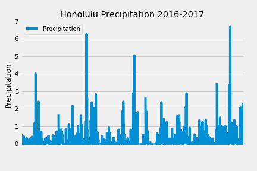

# SQLAlchemy - Surfs Up!

## Step 1 - Climate Analysis and Exploration

To begin, use Python and SQLAlchemy to do basic climate analysis and data exploration of the climate database.

### Precipitation Analysis

* Designed a query to retrieve the last 12 months of precipitation data.

* Select only the `date` and `prcp` values.

* Load the query results into a Pandas DataFrame and set the index to the date column.

* Sort the DataFrame values by `date`.

* Plot the results using the DataFrame `plot` method.

  

* Use Pandas to print the summary statistics for the precipitation data.

### Station Analysis

* Designed a query to calculate the total number of stations.

* Designed a query to find the most active stations.

* Designed a query to retrieve the last 12 months of temperature observation data (tobs).

    

- - -

## Step 2 - Climate App
Designed a Flask API based on the queries that have just developed.

